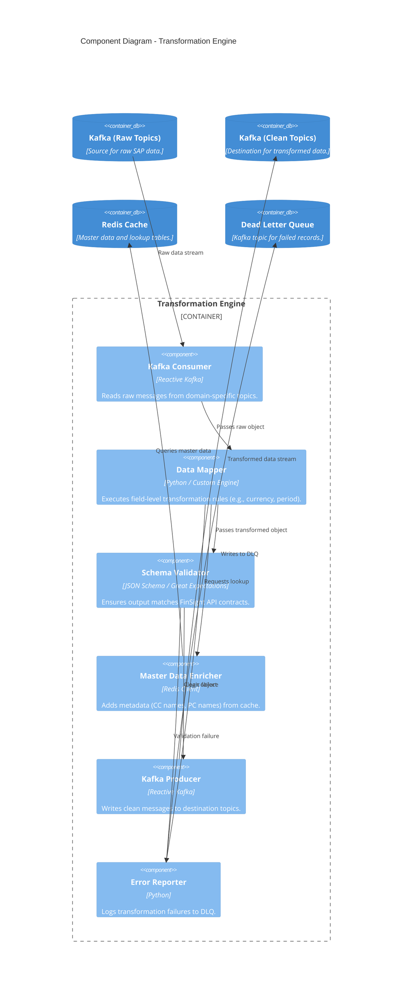

# DGM: C4 Level 3 - Component Diagram (Transformation Engine)

```mermaid
C4Component
    title Component Diagram - Transformation Engine

    ContainerDb(kafka_raw, "Kafka (Raw Topics)", "Source for raw SAP data.")
    ContainerDb(kafka_clean, "Kafka (Clean Topics)", "Destination for transformed data.")

    Container_Boundary(transform_engine, "Transformation Engine") {
        Component(consumer, "Kafka Consumer", "Reactive Kafka", "Reads raw messages from domain-specific topics.")
        Component(mapper, "Data Mapper", "Python / Custom Engine", "Executes field-level transformation rules (e.g., currency, period).")
        Component(validator, "Schema Validator", "JSON Schema / Great Expectations", "Ensures output matches FinSight API contracts.")
        Component(enricher, "Master Data Enricher", "Redis Client", "Adds metadata (CC names, PC names) from cache.")
        Component(producer, "Kafka Producer", "Reactive Kafka", "Writes clean messages to destination topics.")
        Component(error_reporter, "Error Reporter", "Python", "Logs transformation failures to DLQ.")
    }

    ContainerDb(redis, "Redis Cache", "Master data and lookup tables.")
    ContainerDb(dlq, "Dead Letter Queue", "Kafka topic for failed records.")

    Rel(kafka_raw, consumer, "Raw data stream")
    Rel(consumer, mapper, "Passes raw object")
    Rel(mapper, enricher, "Requests lookup")
    Rel(enricher, redis, "Queries master data")
    Rel(mapper, validator, "Passes transformed object")
    Rel(validator, producer, "Clean object")
    Rel(validator, error_reporter, "Validation failure")
    Rel(mapper, error_reporter, "Logic failure")
    Rel(producer, kafka_clean, "Transformed data stream")
    Rel(error_reporter, dlq, "Writes to DLQ")
```
