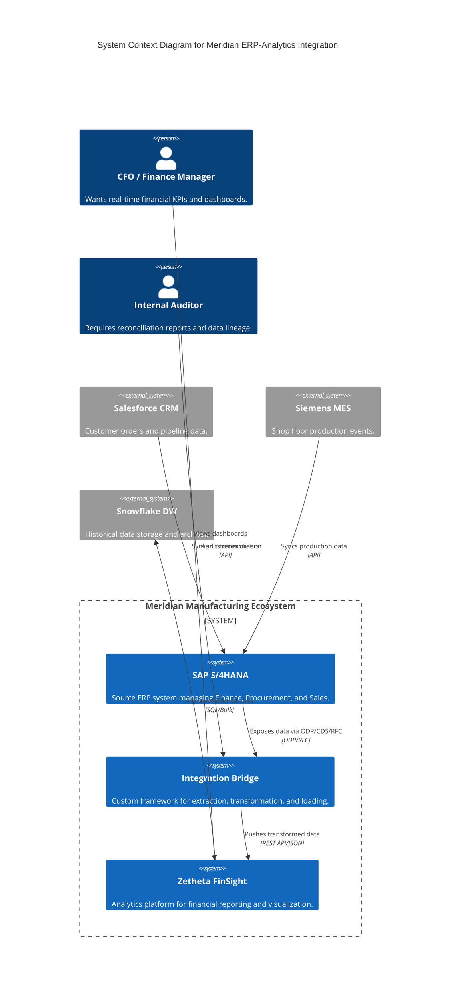

# DGM: C4 Level 1 - System Context Diagram

```mermaid
C4Context
    title System Context Diagram for Meridian ERP-Analytics Integration

    Person(cfo, "CFO / Finance Manager", "Wants real-time financial KPIs and dashboards.")
    Person(auditor, "Internal Auditor", "Requires reconciliation reports and data lineage.")
    
    System_Boundary(meridian, "Meridian Manufacturing Ecosystem") {
        System(sap, "SAP S/4HANA", "Source ERP system managing Finance, Procurement, and Sales.")
        System(integration_bridge, "Integration Bridge", "Custom framework for extraction, transformation, and loading.")
        System(finsight, "Zetheta FinSight", "Analytics platform for financial reporting and visualization.")
    }

    System_Ext(salesforce, "Salesforce CRM", "Customer orders and pipeline data.")
    System_Ext(mes, "Siemens MES", "Shop floor production events.")
    System_Ext(snowflake, "Snowflake DW", "Historical data storage and archival.")

    Rel(cfo, finsight, "Views dashboards")
    Rel(auditor, integration_bridge, "Audits reconciliation")
    
    Rel(sap, integration_bridge, "Exposes data via ODP/CDS/RFC", "ODP/RFC")
    Rel(integration_bridge, finsight, "Pushes transformed data", "REST API/JSON")
    
    Rel(salesforce, sap, "Syncs customer orders", "API")
    Rel(mes, sap, "Syncs production data", "API")
    Rel(finsight, snowflake, "Archives historical data", "SQL/Bulk")
```
