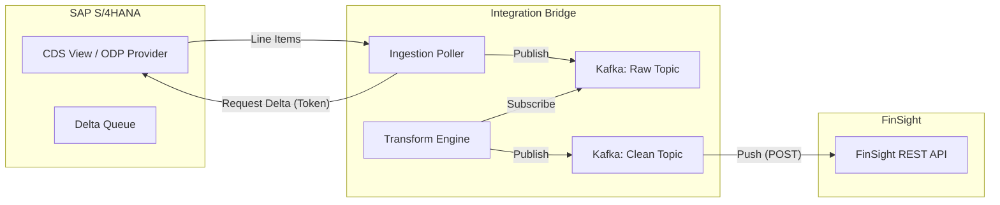
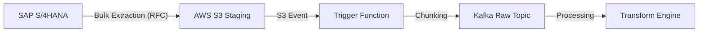
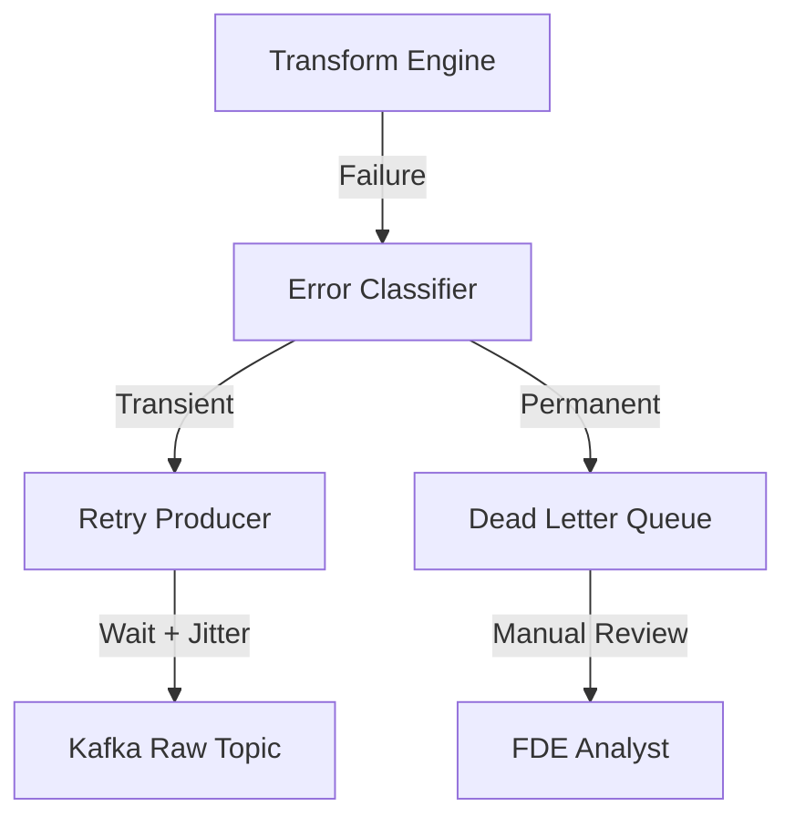
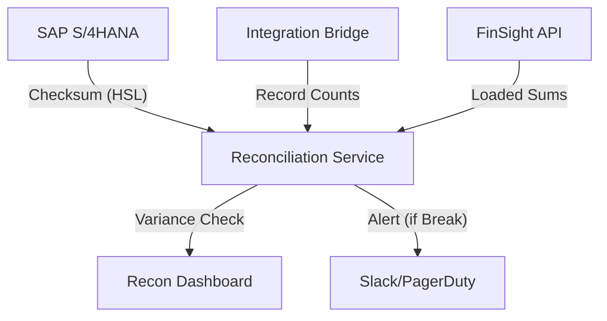

# DGM: Data Flow Diagrams

## 1. Real-time ODP Delta Flow

```mermaid
graph LR
    subgraph SAP[SAP S/4HANA]
        CDS[CDS View / ODP Provider]
        Delta[Delta Queue]
    end
    
    subgraph Bridge[Integration Bridge]
        Poll[Ingestion Poller]
        KafkaRaw[Kafka: Raw Topic]
        Transform[Transform Engine]
        KafkaClean[Kafka: Clean Topic]
    end
    
    subgraph Target[FinSight]
        API[FinSight REST API]
    end

    Poll -- "Request Delta (Token)" --> CDS
    CDS -- "Line Items" --> Poll
    Poll -- "Publish" --> KafkaRaw
    Transform -- "Subscribe" --> KafkaRaw
    Transform -- "Publish" --> KafkaClean
    KafkaClean -- "Push (POST)" --> API
```

## 2. Batch Extraction Flow (Historical/Large)

```mermaid
graph LR
    SAP[SAP S/4HANA] -- "Bulk Extraction (RFC)" --> S3[AWS S3 Staging]
    S3 -- "S3 Event" --> Lambda[Trigger Function]
    Lambda -- "Chunking" --> Kafka[Kafka Raw Topic]
    Kafka -- "Processing" --> Transform[Transform Engine]
```

## 3. Error Handling & Retry Flow

```mermaid
graph TD
    Transform[Transform Engine] -- "Failure" --> ErrorClass[Error Classifier]
    ErrorClass -- "Transient" --> Retry[Retry Producer]
    Retry -- "Wait + Jitter" --> KafkaRaw[Kafka Raw Topic]
    ErrorClass -- "Permanent" --> DLQ[Dead Letter Queue]
    DLQ -- "Manual Review" --> Admin[FDE Analyst]
```

## 4. Reconciliation & Audit Flow

```mermaid
graph TD
    SAP[SAP S/4HANA] -- "Checksum (HSL)" --> Recon[Reconciliation Service]
    Bridge[Integration Bridge] -- "Record Counts" --> Recon
    FinSight[FinSight API] -- "Loaded Sums" --> Recon
    Recon -- "Variance Check" --> Report[Recon Dashboard]
    Recon -- "Alert (if Break)" --> Slack[Slack/PagerDuty]
```
