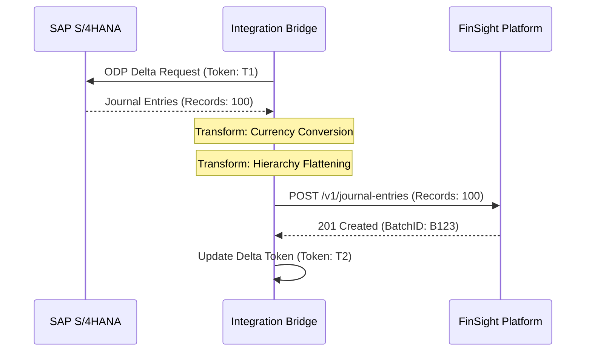
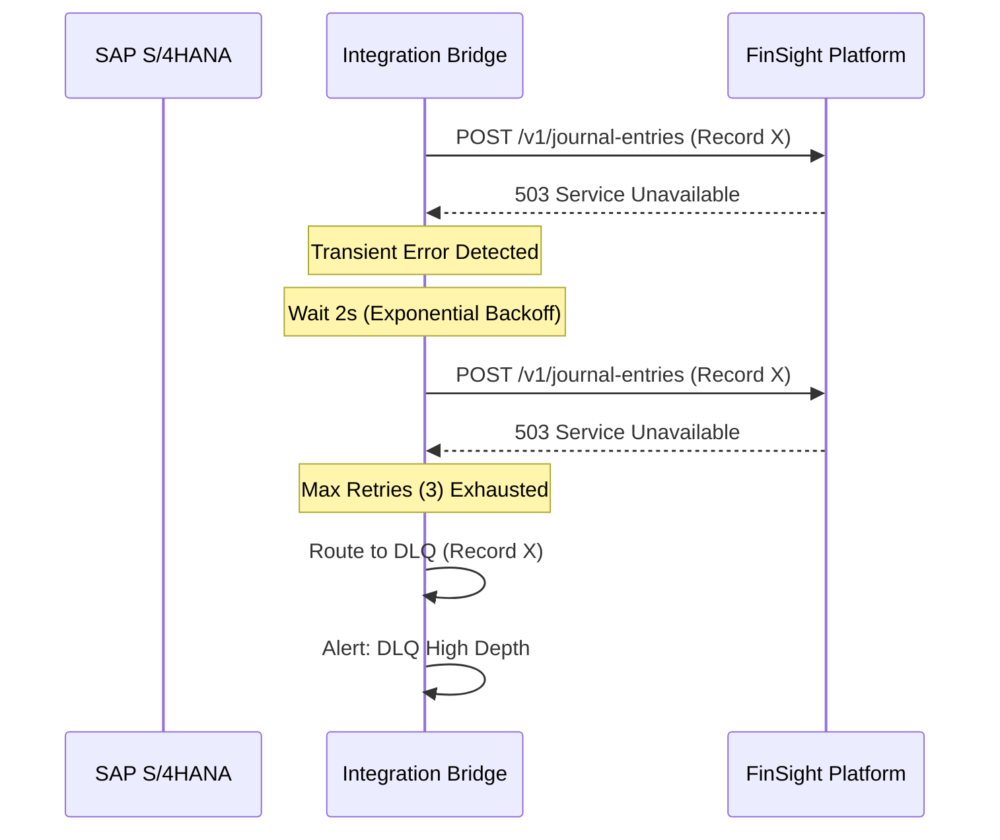
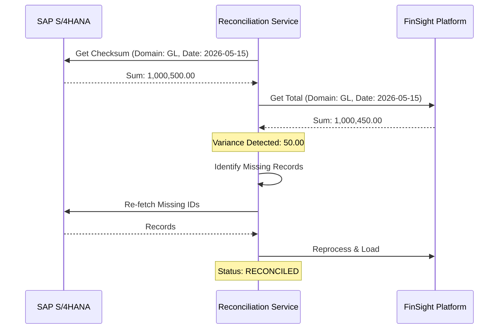

# DGM: Sequence Diagrams

## 1. Happy Path End-to-End Sync

```mermaid
sequenceDiagram
    participant SAP as SAP S/4HANA
    participant Bridge as Integration Bridge
    participant Target as FinSight Platform

    Bridge->>SAP: ODP Delta Request (Token: T1)
    SAP-->>Bridge: Journal Entries (Records: 100)
    Note over Bridge: Transform: Currency Conversion
    Note over Bridge: Transform: Hierarchy Flattening
    Bridge->>Target: POST /v1/journal-entries (Records: 100)
    Target-->>Bridge: 201 Created (BatchID: B123)
    Bridge->>Bridge: Update Delta Token (Token: T2)
```

## 2. Error Scenario with Retry & DLQ

```mermaid
sequenceDiagram
    participant SAP as SAP S/4HANA
    participant Bridge as Integration Bridge
    participant Target as FinSight Platform

    Bridge->>Target: POST /v1/journal-entries (Record X)
    Target-->>Bridge: 503 Service Unavailable
    Note over Bridge: Transient Error Detected
    Note over Bridge: Wait 2s (Exponential Backoff)
    Bridge->>Target: POST /v1/journal-entries (Record X)
    Target-->>Bridge: 503 Service Unavailable
    Note over Bridge: Max Retries (3) Exhausted
    Bridge->>Bridge: Route to DLQ (Record X)
    Bridge->>Bridge: Alert: DLQ High Depth
```

## 3. Reconciliation Mismatch Resolution

```mermaid
sequenceDiagram
    participant SAP as SAP S/4HANA
    participant Bridge as Reconciliation Service
    participant Target as FinSight Platform

    Bridge->>SAP: Get Checksum (Domain: GL, Date: 2026-05-15)
    SAP-->>Bridge: Sum: 1,000,500.00
    Bridge->>Target: Get Total (Domain: GL, Date: 2026-05-15)
    Target-->>Bridge: Sum: 1,000,450.00
    Note over Bridge: Variance Detected: 50.00
    Bridge->>Bridge: Identify Missing Records
    Bridge->>SAP: Re-fetch Missing IDs
    SAP-->>Bridge: Records
    Bridge->>Target: Reprocess & Load
    Note over Bridge: Status: RECONCILED
```
